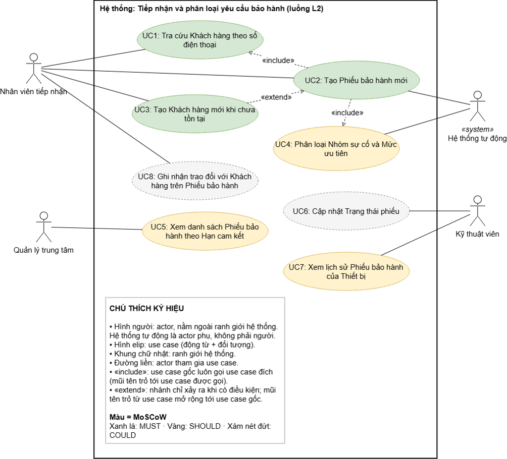

**CHUYÊN ĐỀ TỐT NGHIỆP 1**

Hệ thống: Smart CRM – Mekong Mobile 

Luồng: L2 – Tiếp nhận và phân loại yêu cầu bảo hành

Sinh viên: Hà Đăng Khoa · MSSV: 2374802010228 · Track: SE

# Mục 1: BẢN ĐẶC TẢ YÊU CẦU PHẦN MỀM RÚT GỌN (SRS)

# 1. Giới thiệu và phạm vi

**Bối cảnh:** Mekong Mobile là chuỗi bán lẻ điện thoại có 6 trung tâm bảo hành, khoảng 260 yêu cầu bảo hành mỗi tháng. Hiện yêu cầu được ghi trên phiếu giấy, mỗi trung tâm lưu một cách; khoảng 15% phiếu quá hạn mà không được cảnh báo (vấn đề V2) và mô tả lỗi không được phân nhóm (V8).

**Luồng chọn (L2):** Nhân viên tiếp nhận ghi nhận yêu cầu bảo hành: tra cứu khách hàng theo số điện thoại, chọn thiết bị, nhập mô tả lỗi; hệ thống đề xuất nhóm sự cố và mức ưu tiên, sinh hạn cam kết, và cho phép theo dõi trạng thái phiếu.

**Chủ ý KHÔNG làm (mức WON'T của MoSCoW):**

- Phân công kỹ thuật viên và đặt lịch hẹn (thuộc luồng L4).

- Quản lý kho linh kiện (luồng L5) và khảo sát hài lòng (luồng L8).

- Mô hình học máy tự động phân loại nhóm sự cố (luồng L10); đề xuất trong US4 chỉ dùng quy tắc từ khóa.

- Gửi tin nhắn thông báo cho khách hàng; tích hợp thanh toán chi phí sửa chữa.

- Hợp nhất hồ sơ khách hàng trùng (luồng L1).

**Bảng thuật ngữ**

| Thuật ngữ           | Định nghĩa                                                                                                                   | Tên kỹ thuật                  |
|---------------------|------------------------------------------------------------------------------------------------------------------------------|-------------------------------|
| Khách hàng          | Cá nhân đã mua sản phẩm hoặc dùng dịch vụ của Mekong Mobile                                                                  | customer                      |
| Thiết bị            | Một máy cụ thể của khách hàng, xác định bằng số serial hoặc IMEI                                                             | device                        |
| Phiếu bảo hành      | Yêu cầu bảo hành hoặc sửa chữa được ghi nhận, có mã duy nhất và vòng đời                                                     | ticket                        |
| Trạng thái phiếu    | Vị trí của Phiếu bảo hành trong vòng đời: MỚI → ĐÃ PHÂN CÔNG → ĐANG XỬ LÝ → CHỜ LINH KIỆN → HOÀN TẤT → ĐÃ ĐÓNG; nhánh ĐÃ HỦY | status (MOI, DA_PHAN_CONG, …) |
| Hạn cam kết         | Thời điểm chậm nhất phải hoàn tất phiếu bảo hành, tính từ lúc tiếp nhận                                                      | due_date                      |
| Nhóm sự cố          | Phân loại nguyên nhân: màn hình, pin, sạc, phần mềm, nước vào, khác                                                          | issue_category                |
| Mức ưu tiên         | Mức khẩn của phiếu bảo hành: CAO, TRUNG BÌNH, THẤP; quyết định hạn cam kết                                                   | priority                      |
| Mô tả lỗi           | Nội dung lỗi do khách hàng kể, ghi bằng văn bản                                                                              | issue_desc                    |
| Ghi chú trao đổi    | Một nội dung trao đổi giữa nhân viên tiếp nhận và khách hàng, gắn với một Phiếu bảo hành, kèm thời điểm và người ghi         | ticket_note                   |
| Nhân viên tiếp nhận | Nhân viên trung tâm bảo hành tiếp nhận yêu cầu và ghi phiếu bảo hành                                                         | \-                            |
| Kỹ thuật viên       | Nhân viên thực hiện sửa chữa                                                                                                 | technician                    |
| Quản lý trung tâm   | Người quản lý trung tâm bảo hành, theo dõi hạn cam kết và phê duyệt ngoại lệ                                                 | \-                            |
| Trung tâm bảo hành  | Đơn vị tiếp nhận và sửa chữa                                                                                                 | service_center                |
| Hệ thống tự động    | Thành phần của hệ thống sinh mã phiếu, hạn cam kết và đề xuất nhóm sự cố                                                     | \-                            |

# 2. Các bên liên quan và vai trò

| Vai trò (actor)              | Được làm                                                                                                                                                                | Không được làm                                                                                                                                |
|------------------------------|-------------------------------------------------------------------------------------------------------------------------------------------------------------------------|-----------------------------------------------------------------------------------------------------------------------------------------------|
| Nhân viên tiếp nhận          | Tra cứu và tạo khách hàng; tạo phiếu bảo hành; xác nhận hoặc điều chỉnh nhóm sự cố và mức ưu tiên; ghi ghi chú trao đổi; xem phiếu bảo hành của trung tâm bảo hành mình | Xem số điện thoại đầy đủ; xem phiếu bảo hành của trung tâm khác; phê duyệt bảo hành; xóa phiếu bảo hành; sửa hoặc xóa ghi chú trao đổi đã lưu |
| Kỹ thuật viên                | Xem Phiếu bảo hành được gán cho mình; xem lịch sử phiếu bảo hành của thiết bị; cập nhật trạng thái phiếu                                                                | Tạo phiếu bảo hành; xem số điện thoại đầy đủ; đổi kỹ thuật viên của phiếu                                                                     |
| Quản lý trung tâm            | Xem mọi phiếu bảo hành của trung tâm mình và số điện thoại đầy đủ; xem danh sách theo hạn cam kết; phê duyệt Thiết bị hết bảo hành                                      | Xem dữ liệu của trung tâm khác; xóa phiếu bảo hành                                                                                            |
| Hệ thống tự động (actor phụ) | Sinh mã phiếu bảo hành, hạn cam kết; đề xuất nhóm sự cố và mức ưu tiên                                                                                                  | Tự quyết định thay nhân viên tiếp nhận                                                                                                        |

# 3. Yêu cầu chức năng

| Mã  | Yêu cầu chức năng                                                                                                                                                                            |
|-----|----------------------------------------------------------------------------------------------------------------------------------------------------------------------------------------------|
| FR1 | Hệ thống cho phép nhân viên tiếp nhận tra cứu khách hàng bằng số điện thoại (chuẩn hóa về 10 chữ số trước khi so khớp) và trả về họ tên, địa chỉ cùng danh sách thiết bị của khách hàng đó.  |
| FR2 | Khi Nhân viên tiếp nhận bấm lưu với đủ khách hàng, thiết bị và Mô tả lỗi, hệ thống lưu một Phiếu bảo hành ở trạng thái MỚI có mã duy nhất dạng BH-XXXXXX/YYYY và hạn cam kết tính theo QT02. |
| FR3 | Hệ thống tạo hồ sơ Khách hàng mới khi số điện thoại chưa tồn tại, và không tạo hồ sơ thứ hai khi số điện thoại đã tồn tại.                                                                   |
| FR4 | Hệ thống đề xuất Nhóm sự cố và Mức ưu tiên từ Mô tả lỗi; Nhân viên tiếp nhận có thể xác nhận hoặc điều chỉnh trước khi lưu.                                                                  |
| FR5 | Hệ thống hiển thị danh sách Phiếu bảo hành có lọc theo Trạng thái phiếu, sắp theo Hạn cam kết tăng dần và có phân trang.                                                                     |
| FR6 | Hệ thống cho phép chuyển Trạng thái phiếu theo đúng vòng đời và ghi mỗi lần chuyển kèm thời điểm và người thực hiện.                                                                         |
| FR7 | Hệ thống hiển thị danh sách các Phiếu bảo hành trước đó của một Thiết bị kèm Nhóm sự cố, và gắn cảnh báo "lỗi lặp lại" khi Thiết bị có từ ba Phiếu bảo hành cùng Nhóm sự cố.                 |
| FR8 | Hệ thống lưu mỗi nội dung trao đổi với Khách hàng thành một Ghi chú trao đổi gắn với Phiếu bảo hành, kèm thời điểm và người ghi; Ghi chú trao đổi đã lưu không được sửa hoặc xóa.            |

**User Story**

| Mã  | User Story                                                                                                                                                                                           | MoSCoW |
|-----|------------------------------------------------------------------------------------------------------------------------------------------------------------------------------------------------------|--------|
| US1 | Là Nhân viên tiếp nhận, tôi muốn tra cứu Khách hàng bằng số điện thoại và xem danh sách Thiết bị, để không phải hỏi lại thông tin đã có trong hệ thống.                                              | MUST   |
| US2 | Là Nhân viên tiếp nhận, tôi muốn tạo Phiếu bảo hành mới kèm Mô tả lỗi, để mọi yêu cầu được ghi nhận có mã duy nhất và Hạn cam kết.                                                                   | MUST   |
| US3 | Là Nhân viên tiếp nhận, tôi muốn tạo Khách hàng mới khi số điện thoại chưa tồn tại, để không dừng việc tiếp nhận và không sinh hồ sơ trùng.                                                          | MUST   |
| US4 | Là Nhân viên tiếp nhận, tôi muốn hệ thống đề xuất Nhóm sự cố và Mức ưu tiên, để phân loại nhất quán giữa các nhân viên.                                                                              | SHOULD |
| US5 | Là Quản lý trung tâm, tôi muốn xem danh sách Phiếu bảo hành theo Hạn cam kết, để biết phiếu nào sắp quá hạn và xử lý trước.                                                                          | SHOULD |
| US6 | Là Kỹ thuật viên, tôi muốn cập nhật Trạng thái phiếu, để mọi người biết Phiếu bảo hành đang ở bước nào.                                                                                              | COULD  |
| US7 | Là Kỹ thuật viên, tôi muốn xem các Phiếu bảo hành trước đó của một Thiết bị kèm Nhóm sự cố, để nhận ra lỗi lặp lại lần thứ ba và báo lên thay vì sửa tiếp.                                           | SHOULD |
| US8 | Là Nhân viên tiếp nhận, tôi muốn ghi lại nội dung trao đổi với Khách hàng theo từng Phiếu bảo hành, kèm thời điểm và người ghi, để không phải hỏi lại Khách hàng và có căn cứ khi xảy ra tranh chấp. | COULD  |

*Phân bố MoSCoW: 3 MUST (US1–US3) · 3 SHOULD (US4, US5, US7) · 2 COULD (US6, US8).*

# 4. Yêu cầu phi chức năng

| Mã   | Loại               | Yêu cầu (có ngưỡng đo được)                                                                                                                                                                                            | Cách kiểm chứng                             |
|------|--------------------|------------------------------------------------------------------------------------------------------------------------------------------------------------------------------------------------------------------------|---------------------------------------------|
| NFR1 | Hiệu năng          | Với 10.000 Phiếu bảo hành trong cơ sở dữ liệu và 20 người dùng đồng thời, 95% yêu cầu tạo Phiếu bảo hành (FR2) và 95% yêu cầu xem danh sách (FR5) hoàn tất trong dưới 2 giây.                                          | Kiểm thử tải ở BT3, báo cáo phân vị 95      |
| NFR2 | Bảo mật            | 100% phản hồi gửi tới vai trò không phải Quản lý trung tâm hiển thị số điện thoại dạng che (ví dụ 090\*\*\*\*567); 100% yêu cầu không có phiên hợp lệ bị từ chối; phiên đăng nhập hết hạn sau 30 phút không hoạt động. | Kiểm thử phân quyền từng vai trò ở BT3      |
| NFR3 | Lưu trữ và tin cậy | Lưu được ít nhất 50.000 Phiếu bảo hành mà vẫn đạt NFR1; 0 Phiếu bảo hành mất hoặc trùng trong 100 lần ngắt kết nối giữa lúc lưu; sao lưu mỗi ngày, mất dữ liệu tối đa 24 giờ và khôi phục trong tối đa 4 giờ.          | Kiểm thử ngắt kết nối và diễn tập khôi phục |

# 5. Ràng buộc và quy tắc nghiệp vụ

| Mã   | Quy tắc                                                                                                                                                                                                                                                                                                                                              | Nguồn (Bảng 9.1) |
|------|------------------------------------------------------------------------------------------------------------------------------------------------------------------------------------------------------------------------------------------------------------------------------------------------------------------------------------------------------|------------------|
| QT01 | **Thời hạn bảo hành.** Thiết bị còn bảo hành nếu (ngày tiếp nhận − ngày mua) ≤ số tháng bảo hành của sản phẩm (mặc định 12 tháng). Thiết bị hết bảo hành hoặc không có ngày mua thì Phiếu bảo hành phải có phê duyệt của Quản lý trung tâm mới được lưu.                                                                                             | QT-05            |
| QT02 | **Phân loại và Hạn cam kết.** Số điện thoại chuẩn hóa về 10 chữ số bắt đầu bằng 0. Hạn cam kết sinh tự động từ thời điểm tiếp nhận theo Mức ưu tiên: CAO = 24 giờ, TRUNG BÌNH = 72 giờ, THẤP = 120 giờ, chỉ tính thứ Hai đến thứ Bảy. Nhóm sự cố thuộc một trong sáu giá trị: MAN_HINH, PIN, SAC, PHAN_MEM, NUOC_VAO, KHAC.                          | QT-02, QT-04     |
| QT03 | **Trạng thái phiếu và lịch sử.** Chỉ chuyển Trạng thái phiếu theo vòng đời, không quay lại trạng thái trước; mỗi lần chuyển ghi vào ticket_status_log. Không xóa vật lý Phiếu bảo hành, chỉ đánh dấu ngừng sử dụng. Ghi chú trao đổi đã lưu không được sửa hoặc xóa. Một Thiết bị chỉ có tối đa một Phiếu bảo hành chưa đóng (bổ sung từ phân tích). | QT-06, QT-13     |

# 6. Bảng truy vết yêu cầu

| Mã FR | Yêu cầu chức năng                                             | User Story | Use Case                                                   | MoSCoW | Endpoint                                                  |
|-------|---------------------------------------------------------------|------------|------------------------------------------------------------|--------|-----------------------------------------------------------|
| FR1   | Tra cứu Khách hàng theo số điện thoại                         | US1        | UC1 – Tra cứu Khách hàng theo số điện thoại                | MUST   | GET /api/customers; GET /api/customers/{id}/devices       |
| FR2   | Tạo Phiếu bảo hành với mã và Hạn cam kết                      | US2        | UC2 – Tạo Phiếu bảo hành mới                               | MUST   | POST /api/tickets                                         |
| FR3   | Tạo Khách hàng mới khi chưa tồn tại                           | US3        | UC3 – Tạo Khách hàng mới khi chưa tồn tại                  | MUST   | POST /api/customers                                       |
| FR4   | Đề xuất Nhóm sự cố và Mức ưu tiên                             | US4        | UC4 – Phân loại Nhóm sự cố và Mức ưu tiên                  | SHOULD | POST /api/tickets (trường category_id, priority)          |
| FR5   | Xem danh sách Phiếu bảo hành theo Hạn cam kết                 | US5        | UC5 – Xem danh sách Phiếu bảo hành theo Hạn cam kết        | SHOULD | GET /api/tickets                                          |
| FR6   | Chuyển Trạng thái phiếu và ghi lịch sử                        | US6        | UC6 – Cập nhật Trạng thái phiếu                            | COULD  | PATCH /api/tickets/{id}/status                            |
| FR7   | Xem lịch sử Phiếu bảo hành của Thiết bị, cảnh báo lỗi lặp lại | US7        | UC7 – Xem lịch sử Phiếu bảo hành của Thiết bị              | SHOULD | GET /api/tickets?device_id=                               |
| FR8   | Lưu Ghi chú trao đổi trên Phiếu bảo hành                      | US8        | UC8 – Ghi nhận trao đổi với Khách hàng trên Phiếu bảo hành | COULD  | POST /api/tickets/{id}/notes; GET /api/tickets/{id}/notes |

# Mục 2: User Story: tự kiểm INVEST và tiêu chí chấp nhận

## 1. Tự kiểm INVEST và nguồn vấn đề

| Story | Vấn đề giải quyết (case study)                                                       | Kết quả INVEST (I-N-V-E-S-T)                                                              |
|-------|--------------------------------------------------------------------------------------|-------------------------------------------------------------------------------------------|
| US1   | V1, V2 (chị Lan: không phải hỏi lại thông tin)                                       | Đạt 6/6. Chỉ đọc dữ liệu nên độc lập.                                                     |
| US2   | V2 (phiếu giấy, không biết trạng thái)                                               | Đạt 6/6. Cần dữ liệu từ US1 nhưng thử được bằng dữ liệu mẫu.                              |
| US3   | V1 (hồ sơ trùng)                                                                     | Đạt 6/6. Nhánh ngoại lệ của US1, tách riêng để chấp nhận độc lập.                         |
| US4   | V8 (mô tả lỗi không phân nhóm)                                                       | Đạt 6/6. Đề xuất theo quy tắc từ khóa; mô hình học máy thuộc L10 (WON'T).                 |
| US5   | V2 (chị Trâm: cần màn hình thấy phiếu sắp quá hạn)                                   | Đạt 6/6. Chỉ đọc.                                                                         |
| US6   | V2 (không biết phiếu ở bước nào)                                                     | Đạt 6/6. Không gán Kỹ thuật viên (thuộc L4).                                              |
| US7   | Phát biểu của anh Dũng: sửa lần ba cùng lỗi thường là lỗi lô hàng                    | Đạt 6/6. Chỉ đọc; ngưỡng "từ ba Phiếu" kiểm chứng được.                                   |
| US8   | Phát biểu của chị Lan: yêu cầu thật đằng sau ô ghi chú tự do là lưu lịch sử trao đổi | Đạt 6/6. Nêu mục tiêu (lịch sử có thời điểm, người ghi), không nêu giải pháp "ô ghi chú". |

## 2. Tiêu chí chấp nhận cho story MUST (Given – When – Then)

**US1 – Tra cứu Khách hàng theo số điện thoại**

- **AC1 (luồng chính).** GIVEN số điện thoại 0901234567 đã có trong hệ thống, WHEN Nhân viên tiếp nhận nhập số này vào ô tra cứu, THEN hệ thống hiển thị họ tên, địa chỉ của Khách hàng và danh sách Thiết bị của Khách hàng đó.

- **AC2 (ngoại lệ).** GIVEN số điện thoại chưa có trong hệ thống, WHEN Nhân viên tiếp nhận tra cứu, THEN hệ thống thông báo "Không tìm thấy Khách hàng" và đề nghị tạo Khách hàng mới (US3).

- **AC3 (xác thực).** GIVEN Nhân viên tiếp nhận nhập "+84 901 234 567", WHEN tra cứu, THEN hệ thống chuẩn hóa về 0901234567 trước khi so khớp; nếu chuỗi nhập không quy được về đúng 10 chữ số bắt đầu bằng 0, THEN hệ thống từ chối và nêu rõ định dạng hợp lệ.

**US2 – Tạo Phiếu bảo hành mới**

- **AC1 (luồng chính).** GIVEN đã chọn Khách hàng và Thiết bị còn bảo hành, Mô tả lỗi dài 10–2000 ký tự, WHEN Nhân viên tiếp nhận bấm Lưu, THEN hệ thống lưu Phiếu bảo hành ở trạng thái MỚI với mã duy nhất dạng BH-XXXXXX/YYYY và Hạn cam kết tính theo Mức ưu tiên (CAO 24 giờ, TRUNG_BINH 72 giờ, THAP 120 giờ, chỉ tính thứ Hai đến thứ Bảy).

- **AC2 (xác thực).** GIVEN Mô tả lỗi còn để trống, WHEN bấm Lưu, THEN hệ thống từ chối lưu, nêu rõ trường "Mô tả lỗi" còn thiếu và giữ nguyên dữ liệu đã nhập.

- **AC3 (ngoại lệ).** GIVEN Thiết bị đã hết bảo hành theo QT01 và chưa có phê duyệt của Quản lý trung tâm, WHEN bấm Lưu, THEN hệ thống từ chối lưu Phiếu bảo hành và thông báo cần Quản lý trung tâm phê duyệt.

**US3 – Tạo Khách hàng mới khi chưa tồn tại**

- **AC1 (luồng chính).** GIVEN số điện thoại chưa tồn tại, WHEN Nhân viên tiếp nhận nhập họ tên và bấm Lưu, THEN hệ thống tạo hồ sơ Khách hàng với số điện thoại đã chuẩn hóa và quay lại bước chọn Thiết bị.

- **AC2 (ngoại lệ).** GIVEN số điện thoại vừa được một Nhân viên tiếp nhận khác tạo, WHEN Nhân viên tiếp nhận bấm Lưu, THEN hệ thống không tạo hồ sơ thứ hai mà hiển thị hồ sơ Khách hàng đã có.

- **AC3 (xác thực).** GIVEN họ tên để trống, WHEN bấm Lưu, THEN hệ thống từ chối và nêu rõ trường "họ tên" còn thiếu.

## 3. Tiêu chí tóm tắt cho story SHOULD và COULD (bổ sung chi tiết ở BT3)

- **US4:** Mô tả lỗi chứa "màn hình", "vỡ", "sọc" thì đề xuất Nhóm sự cố MAN_HINH; Nhân viên tiếp nhận được xác nhận hoặc điều chỉnh trước khi lưu.

- **US5:** Danh sách mặc định sắp theo Hạn cam kết tăng dần và có bộ lọc Trạng thái phiếu.

- **US6:** Chuyển Trạng thái phiếu sai vòng đời (ví dụ HOÀN TẤT → MỚI) bị từ chối.

- **US7:** GIVEN một Thiết bị đã có hai Phiếu bảo hành cùng Nhóm sự cố PIN, WHEN Kỹ thuật viên xem lịch sử của Thiết bị khi có Phiếu thứ ba cùng Nhóm sự cố PIN, THEN hệ thống hiển thị cảnh báo "lỗi lặp lại".

- **US8:** GIVEN Nhân viên tiếp nhận đã lưu một Ghi chú trao đổi, WHEN mở lại Phiếu bảo hành, THEN hệ thống hiển thị ghi chú kèm thời điểm và tên người ghi, và không có chức năng sửa hoặc xóa ghi chú đó.

# Mục 3: Use Case

## 1. Use Case Diagram

 
*Hình 1 – Use Case Diagram luồng L2*

## 2. Danh sách actor và use case

| Mã  | Use case                                             | Actor                                       | US  | FR  | MoSCoW |
|-----|------------------------------------------------------|---------------------------------------------|-----|-----|--------|
| UC1 | Tra cứu Khách hàng theo số điện thoại                | Nhân viên tiếp nhận                         | US1 | FR1 | MUST   |
| UC2 | Tạo Phiếu bảo hành mới                               | Nhân viên tiếp nhận; Hệ thống tự động (phụ) | US2 | FR2 | MUST   |
| UC3 | Tạo Khách hàng mới khi chưa tồn tại                  | Nhân viên tiếp nhận                         | US3 | FR3 | MUST   |
| UC4 | Phân loại Nhóm sự cố và Mức ưu tiên                  | Hệ thống tự động (phụ)                      | US4 | FR4 | SHOULD |
| UC5 | Xem danh sách Phiếu bảo hành theo Hạn cam kết        | Quản lý trung tâm                           | US5 | FR5 | SHOULD |
| UC6 | Cập nhật Trạng thái phiếu                            | Kỹ thuật viên                               | US6 | FR6 | COULD  |
| UC7 | Xem lịch sử Phiếu bảo hành của Thiết bị              | Kỹ thuật viên                               | US7 | FR7 | SHOULD |
| UC8 | Ghi nhận trao đổi với Khách hàng trên Phiếu bảo hành | Nhân viên tiếp nhận                         | US8 | FR8 | COULD  |

Quan hệ: UC2 «include» UC1 (luôn tra cứu Khách hàng); UC2 «include» UC4 (luôn đề xuất phân loại); UC3 «extend» UC2 (chỉ xảy ra khi Khách hàng chưa tồn tại).

## 3. Đặc tả chi tiết UC2 – Tạo Phiếu bảo hành mới

| Mục                  | Nội dung                                                                                                                                     |
|----------------------|----------------------------------------------------------------------------------------------------------------------------------------------|
| Actor chính          | Nhân viên tiếp nhận                                                                                                                          |
| Actor phụ            | Hệ thống tự động (sinh mã, tính Hạn cam kết, đề xuất Nhóm sự cố và Mức ưu tiên)                                                              |
| Mục tiêu             | Ghi nhận một yêu cầu bảo hành thành Phiếu bảo hành để theo dõi đến khi đóng.                                                                 |
| Điều kiện trước      | Nhân viên tiếp nhận đã đăng nhập và thuộc một Trung tâm bảo hành.                                                                            |
| Điều kiện sau        | Một Phiếu bảo hành ở trạng thái MỚI đã được lưu, có mã duy nhất và Hạn cam kết; lần chuyển trạng thái đầu tiên đã ghi vào ticket_status_log. |
| User Story liên quan | US2, US4 (gọi kèm US1) · Mức ưu tiên: MUST                                                                                                   |

**Luồng chính**

| Bước | Nội dung                                                                                                                               |
|------|----------------------------------------------------------------------------------------------------------------------------------------|
| 1    | Nhân viên tiếp nhận chọn chức năng "Tạo Phiếu bảo hành mới".                                                                           |
| 2    | Nhân viên tiếp nhận nhập số điện thoại của Khách hàng.                                                                                 |
| 3    | Hệ thống hiển thị họ tên, địa chỉ của Khách hàng và danh sách Thiết bị. \[include UC1\]                                                |
| 4    | Nhân viên tiếp nhận chọn Thiết bị cần bảo hành.                                                                                        |
| 5    | Nhân viên tiếp nhận nhập Mô tả lỗi và chọn Phụ kiện kèm theo (tùy chọn).                                                               |
| 6    | Hệ thống tự động đề xuất Nhóm sự cố và Mức ưu tiên. \[include UC4\]                                                                    |
| 7    | Nhân viên tiếp nhận xác nhận hoặc điều chỉnh đề xuất, rồi bấm Lưu.                                                                     |
| 8    | Hệ thống kiểm tra Thiết bị còn bảo hành (QT01) và chưa có Phiếu bảo hành chưa đóng (QT03).                                             |
| 9    | Hệ thống sinh mã Phiếu bảo hành, tính Hạn cam kết theo Mức ưu tiên (QT02), lưu Phiếu ở trạng thái MỚI và hiển thị mã cùng Hạn cam kết. |

**Luồng ngoại lệ** (đánh số theo bước của luồng chính)

| Mã  | Tình huống và cách xử lý                                                                                                                                                        |
|-----|---------------------------------------------------------------------------------------------------------------------------------------------------------------------------------|
| 3a  | Khách hàng chưa tồn tại. Hệ thống mở biểu mẫu tạo Khách hàng với số điện thoại đã điền sẵn \[extend UC3\]; sau khi lưu, quay lại bước 4.                                        |
| 3b  | Số điện thoại sai định dạng (không quy được về 10 chữ số bắt đầu bằng 0). Hệ thống từ chối, nêu định dạng hợp lệ, quay lại bước 2.                                              |
| 6a  | Hệ thống tự động không đề xuất được Nhóm sự cố. Hệ thống để trống Nhóm sự cố, đặt Mức ưu tiên mặc định TRUNG BÌNH; Nhân viên tiếp nhận tự chọn ở bước 7.                        |
| 7a  | Mô tả lỗi để trống hoặc ngoài 10–2000 ký tự. Hệ thống từ chối lưu, nêu rõ trường còn thiếu hoặc sai, giữ nguyên dữ liệu đã nhập.                                                |
| 8a  | Thiết bị hết bảo hành hoặc không có ngày mua, chưa có phê duyệt. Hệ thống từ chối lưu, thông báo cần Quản lý trung tâm phê duyệt; Phiếu bảo hành chỉ lưu được khi có phê duyệt. |
| 8b  | Thiết bị đang có Phiếu bảo hành chưa đóng. Hệ thống từ chối lưu và hiển thị mã Phiếu bảo hành đang mở.                                                                          |
| 9a  | Mất kết nối khi đang lưu. Hệ thống giữ dữ liệu đã nhập, cho phép thử lưu lại và không tạo Phiếu bảo hành trùng.                                                                 |

# Mục 4: Hợp đồng API (Track SE)

## 1. Danh sách endpoint

| \#  | Phương thức | Đường dẫn                                                         | Mục đích                                                                          | User Story | MoSCoW |
|-----|-------------|-------------------------------------------------------------------|-----------------------------------------------------------------------------------|------------|--------|
| 1   | GET         | /api/customers?phone={phone}                                      | Tra cứu Khách hàng theo số điện thoại                                             | US1        | MUST   |
| 2   | POST        | /api/customers                                                    | Tạo Khách hàng mới khi chưa tồn tại                                               | US3        | MUST   |
| 3   | GET         | /api/customers/{id}/devices                                       | Lấy danh sách Thiết bị của Khách hàng                                             | US1        | MUST   |
| 4   | POST        | /api/tickets                                                      | Tạo Phiếu bảo hành mới                                                            | US2, US4   | MUST   |
| 5   | GET         | /api/tickets?status=&assignee_id=&overdue=&device_id=&page=&size= | Lấy danh sách Phiếu bảo hành, có lọc và phân trang; lọc theo Thiết bị cho lịch sử | US5, US7   | SHOULD |
| 6   | PATCH       | /api/tickets/{id}/status                                          | Chuyển Trạng thái phiếu                                                           | US6        | COULD  |
| 7   | POST        | /api/tickets/{id}/notes                                           | Ghi một Ghi chú trao đổi vào Phiếu bảo hành                                       | US8        | COULD  |
| 8   | GET         | /api/tickets/{id}/notes                                           | Xem các Ghi chú trao đổi của Phiếu bảo hành                                       | US8        | COULD  |

## 2. Quy ước chung

- **Định dạng:** JSON, mã hóa UTF-8. Header bắt buộc: Content-Type: application/json.

- **Tên trường:** snake_case, khớp tên cột trong cơ sở dữ liệu (ticket, customer, device).

- **Thời gian:** ISO 8601 kèm múi giờ, ví dụ 2026-09-08T14:30:00+07:00. **Tiền tệ:** số nguyên VND, không có phần thập phân.

- **Phân trang:** page (từ 1) và size (mặc định 20, tối đa 100); response danh sách kèm total.

- **Xác thực:** header Authorization: Bearer \<token\>; thiếu hoặc sai token trả 401, sai vai trò trả 403.

- **Che số điện thoại (NFR2):** mọi response trả phone dạng che (090\*\*\*\*567), trừ vai trò Quản lý trung tâm.

- **Chống trùng khi thử lại:** POST /api/tickets nhận header tùy chọn Idempotency-Key; cùng khóa chỉ tạo một Phiếu bảo hành.

- **Cấu trúc lỗi thống nhất:** { "error": { "code": "...", "message": "...", "fields": { } } }

## 3. Chi tiết endpoint POST /api/tickets (US2, US4)

Vai trò được gọi: Nhân viên tiếp nhận, Quản lý trung tâm.

**Request body**

> {
>
> "customer_id": 1024,
>
> "device_id": 3311,
>
> "center_id": 2,
>
> "issue_desc": "Máy sạc không vào, cắm sạc báo lỗi phụ kiện",
>
> "priority": "TRUNG_BINH",
>
> "accessories": \["SAC", "HOP"\]
>
> }

**Response 201 Created**

> {
>
> "ticket_id": 231,
>
> "ticket_code": "BH-000231/2026",
>
> "status": "MOI",
>
> "priority": "TRUNG_BINH",
>
> "category_id": 3,
>
> "is_warranty": true,
>
> "received_at": "2026-09-08T14:30:00+07:00",
>
> "due_date": "2026-09-11T14:30:00+07:00"
>
> }

*category_id là Nhóm sự cố do hệ thống đề xuất (US4). due_date sinh theo QT02: TRUNG_BINH = 72 giờ, chỉ tính thứ Hai đến thứ Bảy.*

**Response lỗi**

| Mã | error.code | Khi nào và nội dung mẫu |
|---|---|---|
| 400 Bad Request | VALIDATION_FAILED | Dữ liệu không hợp lệ. { "error": { "code": "VALIDATION_FAILED", "message": "Dữ liệu không hợp lệ", "fields": { "issue_desc": "Mô tả lỗi phải có từ 10 đến 2000 ký tự" } } } |
| 404 Not Found | CUSTOMER_NOT_FOUND hoặc DEVICE_NOT_FOUND | customer_id hoặc device_id không tồn tại. { "error": { "code": "DEVICE_NOT_FOUND", "message": "Không tìm thấy thiết bị", "fields": { "device_id": 3311 } } } |
| 409 Conflict | DEVICE_HAS_OPEN_TICKET | Thiết bị đang có Phiếu bảo hành chưa đóng (QT03). { "error": { "code": "DEVICE_HAS_OPEN_TICKET", "message": "Thiết bị đang có phiếu bảo hành chưa đóng", "fields": { "open_ticket_code": "BH-000198/2026" } } } |
| 422 Unprocessable Entity | WARRANTY_EXPIRED | Thiết bị hết bảo hành hoặc thiếu ngày mua, chưa có phê duyệt (QT01). { "error": { "code": "WARRANTY_EXPIRED", "message": "Thiết bị đã hết bảo hành, cần Quản lý trung tâm phê duyệt", "fields": { "purchase_date": "2024-06-01", "warranty_months": 12 } } } |
| 401 / 403 / 500 | UNAUTHENTICATED / FORBIDDEN / INTERNAL_ERROR | Thiếu hoặc hết hạn token; vai trò không được tạo Phiếu hoặc center_id khác trung tâm của người gọi; lỗi hệ thống (không tạo Phiếu bảo hành nào). |

## 4. Bảng validation cho POST /api/tickets

| Trường      | Bắt buộc | Kiểu / ràng buộc                                                                                                                             | Thông báo lỗi khi vi phạm                                        |
|-------------|----------|----------------------------------------------------------------------------------------------------------------------------------------------|------------------------------------------------------------------|
| customer_id | Có       | Số nguyên dương; phải tồn tại trong bảng customer (lỗi → 404)                                                                                | Không tìm thấy khách hàng                                        |
| device_id   | Có       | Số nguyên dương; phải tồn tại (lỗi → 404) và thuộc customer_id (lỗi → 400)                                                                   | Không tìm thấy thiết bị / Thiết bị không thuộc về khách hàng này |
| center_id   | Có       | Số nguyên dương; phải tồn tại trong bảng service_center và là Trung tâm bảo hành của người gọi                                               | Trung tâm bảo hành không hợp lệ                                  |
| issue_desc  | Có       | Chuỗi, độ dài 10–2000 ký tự sau khi bỏ khoảng trắng đầu/cuối                                                                                 | Mô tả lỗi phải có từ 10 đến 2000 ký tự                           |
| priority    | Không    | Một trong CAO / TRUNG_BINH / THAP; bỏ trống thì dùng đề xuất của hệ thống (US4), không có đề xuất thì mặc định TRUNG_BINH                    | Mức ưu tiên không hợp lệ                                         |
| accessories | Không    | Mảng, mỗi phần tử thuộc SAC / TAI_NGHE / HOP / KHAC, không trùng lặp                                                                         | Phụ kiện không hợp lệ                                            |
| approved_by | Không    | Số nguyên dương; là employee_id của Quản lý trung tâm cùng Trung tâm bảo hành; chỉ có tác dụng khi Thiết bị hết bảo hành hoặc thiếu ngày mua | Phê duyệt không hợp lệ                                           |

## 5. Tóm tắt các endpoint còn lại

| Endpoint                        | Request                                                                               | Response thành công                                                                                                                | Response lỗi                                                                             |
|---------------------------------|---------------------------------------------------------------------------------------|------------------------------------------------------------------------------------------------------------------------------------|------------------------------------------------------------------------------------------|
| GET /api/customers?phone=       | Query phone (bắt buộc; chuẩn hóa về 10 chữ số theo QT02 rồi so khớp)                  | 200: customer_id, full_name, phone, address, segment                                                                               | 400 sai định dạng số điện thoại; 404 CUSTOMER_NOT_FOUND                                  |
| POST /api/customers             | Body: full_name (bắt buộc, ≤ 120 ký tự), phone (bắt buộc), email, address (tùy chọn)  | 201: hồ sơ Khách hàng vừa tạo                                                                                                      | 400 thiếu hoặc sai trường; 409 số điện thoại đã tồn tại, kèm customer_id hiện có (QT-01) |
| GET /api/customers/{id}/devices | Path id                                                                               | 200: items (device_id, product_name, serial_no, purchase_date, warranty_months), total                                             | 404 Khách hàng không tồn tại; 401 chưa xác thực                                          |
| GET /api/tickets                | Query status, assignee_id, overdue, device_id, page, size; sắp theo due_date tăng dần | 200: items (ticket_code, status, priority, due_date, customer_name, assignee_id, category_name, repeat_warning), page, size, total | 400 giá trị status hoặc size không hợp lệ; 403 vai trò không được xem                    |
| PATCH /api/tickets/{id}/status  | Body: to_status (bắt buộc), note (≤ 255 ký tự)                                        | 200: ticket_id, from_status, to_status, changed_at; ghi vào ticket_status_log                                                      | 404 Phiếu không tồn tại; 409 chuyển sai vòng đời (QT03)                                  |
| POST /api/tickets/{id}/notes    | Body: content (bắt buộc, 1–1000 ký tự)                                                | 201: note_id, ticket_id, content, created_at, created_by                                                                           | 400 content trống hoặc quá dài; 404 Phiếu không tồn tại; 409 Phiếu ĐÃ ĐÓNG hoặc ĐÃ HỦY   |
| GET /api/tickets/{id}/notes     | Path id; sắp theo created_at tăng dần                                                 | 200: items (note_id, content, created_at, created_by), total                                                                       | 404 Phiếu không tồn tại; 403 khác trung tâm                                              |

# Mục 5: Bảng khai báo sử dụng công cụ AI

| Công cụ | Dùng vào việc gì                                                                                  | Áp dụng ở phần nào | Đã kiểm chứng thế nào                                             |
|---------|---------------------------------------------------------------------------------------------------|--------------------|-------------------------------------------------------------------|
| Claude  | Soạn nháp User Story, SRS, tiêu chí chấp nhận, đặc tả Use Case, hợp đồng API; vẽ Use Case Diagram | Mục 1–5            | Đã đối chiếu với tài liệu buổi 3 và case study, tự đọc, chỉnh sửa |

Tôi xác nhận đã đọc, hiểu và chịu trách nhiệm về toàn bộ nội dung nộp.

Họ tên: Hà Đăng Khoa · MSSV: 2374802010228